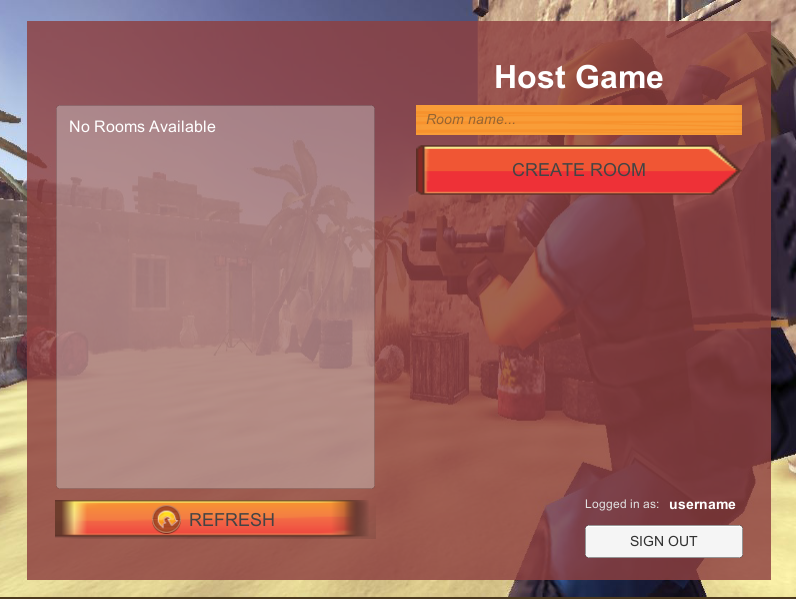
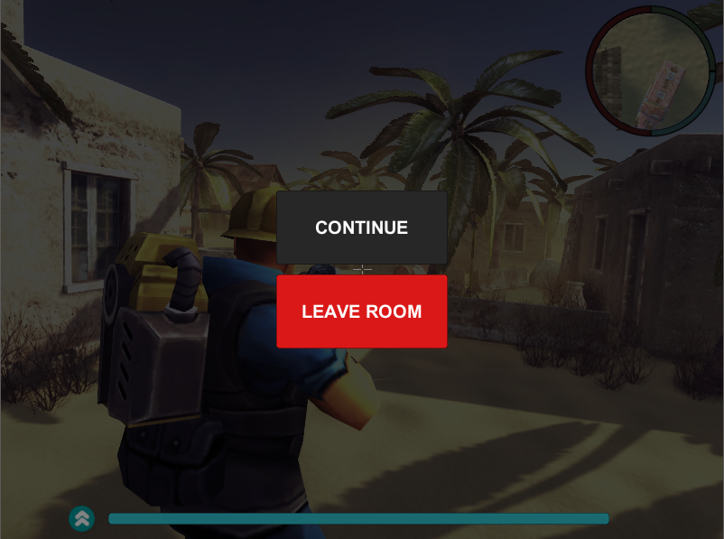

# Multiplayer-fps-unity
This is a multiplayer shooting game made in unity. It is based on Battle Royale strategy where different players join a lobby through internet (here we use free unity server providing upto 20 free users) and are spawned in the map and have a task to kill each other.

## Screenshots

### Lobby

### In Game

### Pause Menu

## References
- **Toon Soldiers** https://assetstore.unity.com/packages/3d/characters/humanoids/toon-soldiers-52220
- **Super Combiner** https://assetstore.unity.com/packages/tools/modeling/super-combiner-92129
- **Desert Environment** http://devassets.com/assets/desert-environment/
